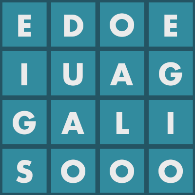
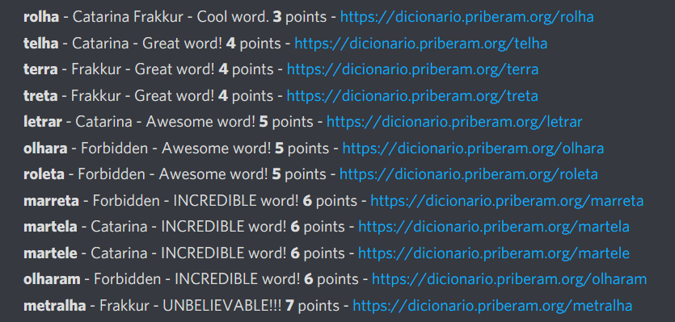
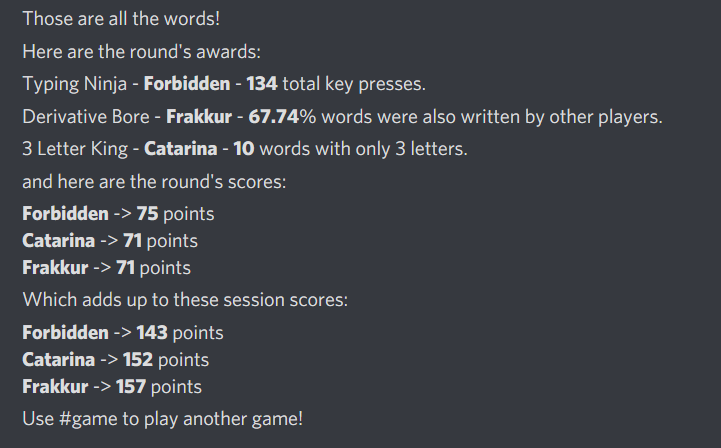

# discordBoggle
This is a discord bot that let's you play boggle on a server of yours! Players can register to play and then are Dm'd by the bot to send the words they find. In the end, the bot will automatically check spelling and verify that the words exist on the board before awarding points automatically!

## Setup
1. Follow the initial setup of creating a bot and adding it to your server [here](https://realpython.com/how-to-make-a-discord-bot-python/).
2. Clone this repository.
3. Install dependencies with pip. **pip install discord**, **pip install pillow**
4. Find your bot token as described in the aforementioned [article](https://realpython.com/how-to-make-a-discord-bot-python/).
5. Open **boggle.py** and scroll down to the last line where it says to add your token.
6. Open a shell and run the bot with **python boggle.py**.

## How To Play
1. Type **#session** on a channel to start a game session. *(Players can only join newly created sessions)*
2. Each player types **#join** to join the session.
3. Type **#game** to start a game.

At this point, the bot will DM each registered player with an image of the game board, such as this one:

Players will DM the bot with all the words they find. Make sure to only send one word per message.
The bot will warn of the time passage at one and two minutes. It will also DM the board image again so Players don't need to scroll up to see it.
At three minutes the bot will warn all to go back to the channel.
The words will be displayed one by one, along with who wrote them, points, and a link to it on the dictionary.

After that, the bot will award some special awards for random things and finally give the points.
The points are then added up to the session totals.

## How to Play Boggle
Find words on a board.
You can start on any letter and can move to adjacent or diagonal letters.
You cannot use the same letter twice in a single word.

## Scoring System
The points system used here is as follows:
One or Two letter words are worth 0 points.
Three letter words are allways worth 1 point.
Longer words are worth their lenght minus two. Plus one additional point if you are the only player to find them.

## Changing the language
1. Replace the contents of **corpus.txt** with text in your language. *(This is used for the letter chances in board generation)*
2. Find some good online dictionary for your language where you can find the word pages by adding them to the web address.
3. Open **spellcheck.py**
4. Edit the function **priblink(word)** and change it to return the link to the dictionary website for the specific word.
5. Edit the function **check(word)** to read the contents of the html string in the variable **web** and determine whether or not the word exists.

## Other info
- The letter "Q" always appears as "Qu", if you want you can change this in **game.py**.
- To change the colors of the board, you can edit them in the function **makeImage** of **game.py**.
- One of the commands is **#selfdestruct** and this command kills the bot. In some bigger servers you might want to remove this. Simply remove the line **self.operations += [operations.ExitOperation()]** from **boggle.py**.
