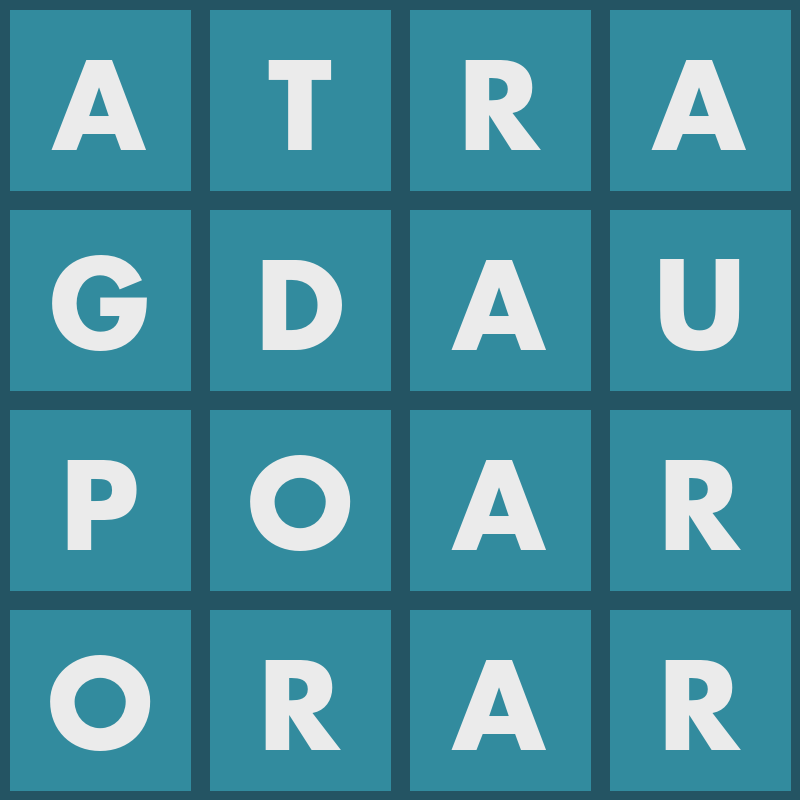

# discordBoggle
This is a discord bot that let's you play boggle on a server of yours! Players can register to play and then are Dm'd by the bot to send the words they find. In the end, the bot will automatically check spelling and verify that the words exist on the board before awarding points automatically!

## Setup
1. Follow the initial setup of creating a bot and adding it to your server [here](https://realpython.com/how-to-make-a-discord-bot-python/).
2. Clone this repository.
3. Find your bot token as described in the aforementioned [article](https://realpython.com/how-to-make-a-discord-bot-python/).
4. Open **boggle.py** and scroll down to the last line where it says to add your token.
5. Open a shell and run the bot with **python boggle.py**.

## How To Play
1. Type **#session** on a channel to start a game session. *(Players can only join newly created sessions)*
2. Each player types **#join** to join the session.
3. Type **#game** to start a game.

At this point, the bot will DM each registered player with an image of the game board, such as this one:

Players will DM the bot with all the words they find. Make sure to only send one word per message.
The bot will warn of the time passage at one and two minutes. It will also DM the board image again so Players don't need to scroll up to see it.
At three minutes the bot will warn all to go back to the channel.
